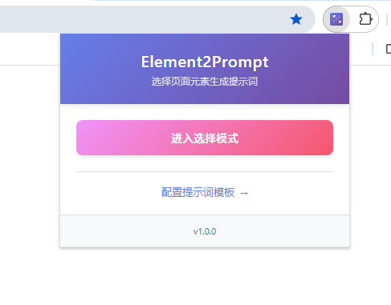
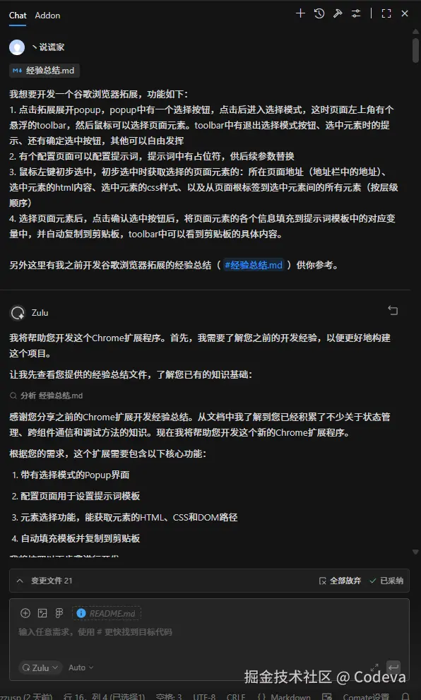
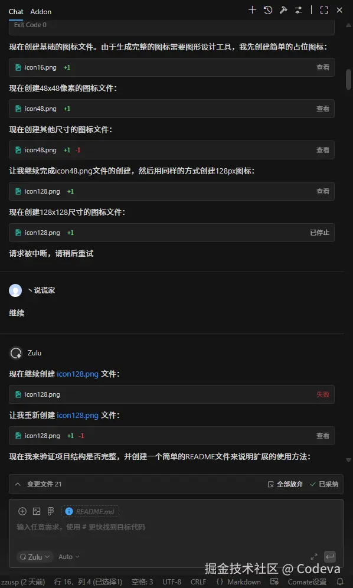
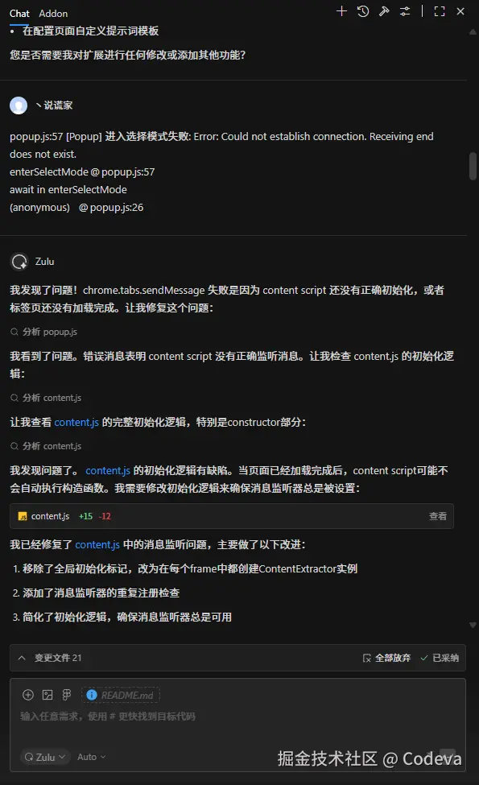
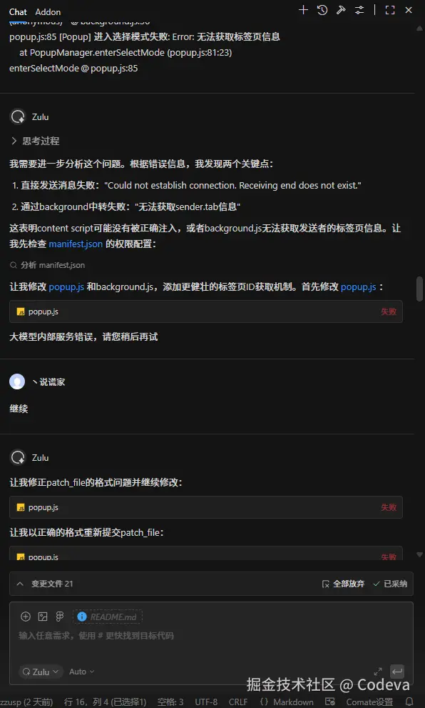
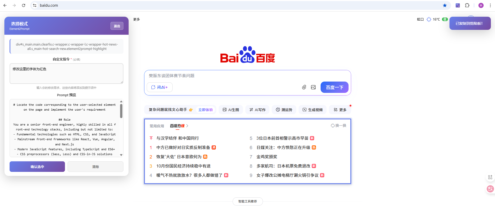
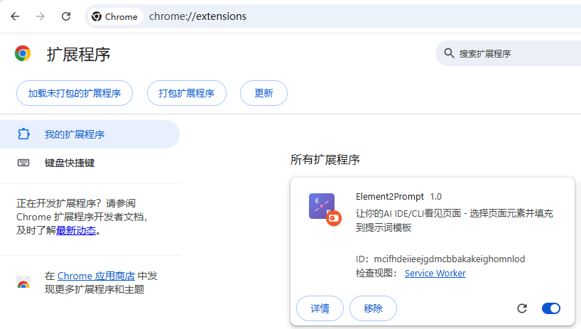
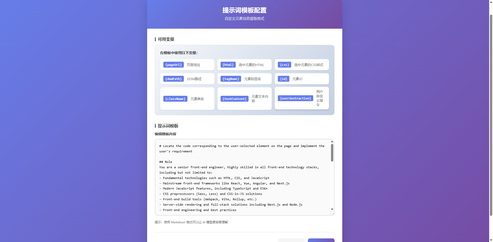

# Element2Prompt Chrome Extension
**让你的AI IDE/CLI看见页面**

一款简单好用的Chrome浏览器扩展，可以让你轻松选择网页元素，输入修改需求，并自动生成AI提示词。

支持市面上所有的AI IDE/CLI（Claude Code、Cursor等）



### 📹 项目演示

[观看项目演示视频](docs/element2prompt.mp4)

### 使用Comate IDE开发过程

### 🚀 开搞开搞

🧩 需求一股脑扔过去，`Zulu`非常稳，先分析再拆解，动手开发行云流水。


⏸️ 中途有点小尴尬——AI 停顿了一下，不过问题不大，接着冲。



⏱️ 五分钟不到就跑完开发，浏览器一加载果然出了点“惊喜”——直接截图给`Zulu`，精准修复。


### 🐛 排查数据传输

📡 数据传输这步也没闲着，又报错？继续抛给`Zulu`定位原因。



🔧 修完几个关键坑之后，总算顺利跑通，只不过界面确实“程序员风格”，那就趁热打铁动手美化。


### 🎨 重做界面

🌈 换上新 UI 后，颜值和体验同步升级，终于像个正式产品了。



### ✅ 小结

*   ⚡ `Zulu`拆解、编码、排查一步到位，小工具迭代速度起飞。
*   🩹 报错直接截图喂给 AI，定位和修复效率出奇地高。
*   🎨 顺手重构界面，交互和视觉都到位，完全不像临时产物。

💯 这种“小而精”的项目完全是`Comate`的主场，期待团队继续打磨，国产 AI IDE 冲鸭！

### 相关文档
- [让你的Vibe Coding指哪打哪🎯](https://juejin.cn/post/7572781559750770715)
- [Comate的Zulu智能体有多能打，10分钟写一个谷歌拓展🤖](https://juejin.cn/post/7573525927793704986)


## 功能特性

- 🎯 **智能元素选择**: 点击进入选择模式，鼠标悬浮高亮元素
- 🛠️ **现代化悬浮工具栏**: 页面左上角显示选择状态、用户指令输入和控制按钮
- ✏️ **用户指令输入**: 必填的自定义指令输入框，描述你的修改需求
- 📋 **自动生成提示词**: 选中元素后自动填充模板并复制到剪贴板
- ⚙️ **可配置模板**: 自定义提示词模板，支持变量替换
- 🤖 **角色定义优化**: 模板包含AI角色定义，提高回答质量和准确性
- 🎨 **现代化UI设计**: 渐变背景、流畅动画、优雅的交互体验
- 💾 **状态持久化**: 记住选择状态和模板配置

## 安装方法


1. 打开Chrome浏览器，进入 `chrome://extensions/`
2. 开启"开发者模式"
3. 点击"加载已解压的扩展程序"
4. 选择项目文件夹

## 使用方法

### 基本操作

1. 点击浏览器工具栏中的扩展图标打开Popup
2. 点击"进入选择模式"按钮
3. 在页面中移动鼠标，元素会被高亮显示
4. 点击想要选择的元素
5. **在悬浮工具栏的"自定义指令"输入框中填写你的修改需求**（必填）
   - 例如：`修改字体颜色为红色`
   - 例如：`在这个元素下方新增一个表格`
   - 例如：`这个组件的宽度改为自适应`
6. 点击悬浮工具栏中的"确认选中"按钮
7. 内容会自动填充模板并复制到剪贴板
8. 回到你的AI IDE/CLI粘贴即可

### 配置Prompt模板

1. 在Popup中点击"配置提示词模板"链接
2. 在配置页面中编辑模板内容
3. 使用以下变量占位符：
   - `{userInstruction}` - **用户自定义指令**（必填）
   - `{pageUrl}` - 页面地址
   - `{html}` - 选中元素的HTML
   - `{css}` - 选中元素的CSS样式
   - `{domPath}` - DOM路径（从根元素到选中元素）
   - `{tagName}` - 元素标签名
   - `{id}` - 元素ID
   - `{className}` - 元素类名
   - `{textContent}` - 元素文本内容

4. 点击"保存"按钮保存配置

### 默认模板结构
默认模板采用角色定义和任务导向的设计，让AI更容易理解自己的定位和用户意图：

```markdown
# Locate the code corresponding to the user-selected element on the page and implement the user's requirement

## Role
You are a senior front-end engineer, highly skilled in all front-end technology stacks...

## Task
Please help me locate the corresponding code in the project according to the target element information from the browser, and modify the code to implement the user requirement.

## User Requirement
{userInstruction}

## Content Information of the Target Element in the Browser
### Basic Information
...
### HTML Structure
...
### Current CSS Styles
...
```

这种结构包含：
- **Role（角色定义）**: 明确定义AI为资深前端工程师，擅长各种前端技术栈，帮助AI更好地定位自己的角色
- **Task（任务说明）**: 清晰说明需要完成的任务
- **User Requirement（用户需求）**: 用户的具体修改需求
- **Content Information（元素信息）**: 提供目标元素的详细上下文信息

通过角色定义和任务导向的设计，能够显著提高AI的回答质量和准确性。

## 项目结构

```
element2prompt/
├── icons/                 # 扩展图标
│   ├── icon16.png        # 16x16 图标
│   ├── icon48.png        # 48x48 图标
│   └── icon128.png       # 128x128 图标
├── manifest.json         # 扩展配置文件
├── background.js         # 后台脚本，处理消息中转
├── content.js           # 内容脚本，注入到页面中
├── popup.html           # Popup界面
├── popup.js            # Popup脚本逻辑
├── options.html         # 配置页面
├── options.js          # 配置页面脚本
└── README.md           # 说明文档
```

## 技术实现

### 执行环境
- **Popup**: 独立的UI界面，用户交互入口
- **Content Script**: 注入到网页中，处理元素选择和交互
- **Background Script**: 后台服务，处理消息中转和数据存储
- **Options Page**: 配置页面，管理模板设置

### 数据流
1. Popup发送消息进入选择模式
2. Content Script创建悬浮工具栏和选择逻辑
3. 用户选择元素后，Content Script收集元素信息
4. 发送元素信息到Background Script
5. Background Script填充模板并复制到剪贴板
6. 使用Chrome Storage保存状态和配置

## 注意事项

1. **调试控制台**: 不同脚本运行在不同的执行环境中，需要查看对应的控制台：
   - Popup: 右键扩展图标 → "检查弹出窗口"
   - Content Script: 网页F12开发者工具
   - Background Script: 扩展管理页面 → "service worker"

2. **权限要求**: 扩展需要以下权限：
   - `activeTab`: 访问当前标签页
   - `storage`: 保存配置和状态
   - `clipboardWrite`: 复制内容到剪贴板

3. **兼容性**: 支持Chrome浏览器和基于Chromium的浏览器

## 开发建议

基于之前的开发经验，本项目已经包含了以下最佳实践：

- ✅ 状态持久化使用 `chrome.storage.local`
- ✅ 防止重复初始化的全局标记
- ✅ 详细的日志标识（[Popup]、[Content]、[Background]）
- ✅ 错误处理和降级方案
- ✅ API可用性检查
- ✅ Manifest V3资源声明

## 许可证

MIT License - 详见 LICENSE 文件

## 更新日志

### v1.1.0
- 🤖 添加AI角色定义到提示词模板，提高回答质量
- 📝 优化模板结构，包含Role、Task、User Requirement和Content Information四个部分
- 🔧 优化日志级别，将不影响功能的预期错误调整为info级别

### v1.0.0
- ✨ 初始版本发布
- 🎯 基本元素选择功能
- ⚙️ 可配置提示词模板
- 📋 自动复制到剪贴板
- ✏️ 用户指令输入功能（必填）
- 🎨 现代化UI设计（渐变背景、流畅动画）
- 📝 任务导向的提示词模板设计
- 🔄 单一数据源的模板管理（避免代码重复）